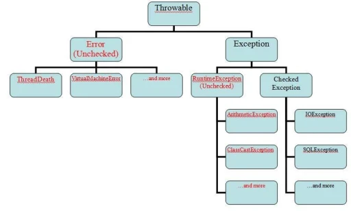

- [1. Что такое исключение? Для чего они нужны?](#1-что-такое-исключение-для-чего-они-нужны)
- [2. Расскажи про иерархию исключений](#2-расскажи-про-иерархию-исключений)
- [3. В чём разница между проверяемыми исключениями и непроверяемыми? В чём разница с точки зрения синтаксиса и идеологическая при использовании?](#3-в-чём-разница-между-проверяемыми-исключениями-и-непроверяемыми-в-чём-разница-с-точки-зрения-синтаксиса-и-идеологическая-при-использовании)
- [4. Можно ли обработать непроверяемое исключение](#4-можно-ли-обработать-непроверяемое-исключение)
- [5. Нужно ли ловить Error исключения?](#5-нужно-ли-ловить-error-исключения)
- [6. Как бросить исключение? Можно ли бросить НЕ новое исключение?](#6-как-бросить-исключение-можно-ли-бросить-не-новое-исключение)
- [7. Расскажи про информацию, которая находится внутри исключения? Как с ней работать?](#7-расскажи-про-информацию-которая-находится-внутри-исключения-как-с-ней-работать)
- [8. Что такое подавленные исключения? Как достать подавленное исключение?](#8-что-такое-подавленные-исключения-как-достать-подавленное-исключение)
- [9. Какую информацию можно получить из StackTraceElement?](#9-какую-информацию-можно-получить-из-stacktraceelement)
- [10. Расскажи про конструкцию try-catch-finally?](#10-расскажи-про-конструкцию-try-catch-finally)
- [11. Что такое try-with-resources? Как работает эта конструкция?](#11-что-такое-try-with-resources-как-работает-эта-конструкция)
- [12. Расскажи, как правильно ловить исключения? Иерархия catch блоков](#12-расскажи-как-правильно-ловить-исключения-иерархия-catch-блоков)
- [13. Можно ли в одном catch обработать несколько исключений?](#13-можно-ли-в-одном-catch-обработать-несколько-исключений)


## 1. Что такое исключение? Для чего они нужны? 
В некотором смысле можно сказать, что исключение - это некоторое сообщение, уведомляющее о проблеме, незапланированном поведении.
В мире программирования возникновение ошибок и непредвиденных ситуаций при выполнении программы называют исключением (exception). В программе исключения могут возникать в результате неправильных действий пользователя, отсутствии необходимого ресурса на диске, или потери соединения с сервером по сети. 
Исключение - это объект некоторого, специально для этого предназначенного, класса.

Возможность предупреждения и разрешения исключительной ситуации в программе для ее продолжения – одна из причин использования исключений в Java. Механизм исключений также позволяет защитить написанный вами код (программный интерфейс) от неправильного использования пользователем за счет валидации (проверки) входящих данных.

## 2. Расскажи про иерархию исключений



Исключительные ситуации, возникающие в программе, можно разделить на две группы: 

1. Ситуации, при которых восстановление дальнейшей нормальной работы программы невозможно
2. Восстановление возможно.

К первой группе относят ситуации, когда возникают исключения, унаследованные из класса Error. Это ошибки, возникающие при выполнении программы в результате сбоя работы JVM, переполнения памяти или сбоя системы. Обычно они свидетельствуют о серьезных проблемах, устранить которые программными средствами невозможно. Такой вид исключений в Java относится к неконтролируемым (unchecked) на стадии компиляции.

К этой группе также относят RuntimeException – исключения, наследники класса Exception, генерируемые  JVM во время выполнения программы. Часто причиной возникновения их являются ошибки программирования. Эти исключения также являются неконтролируемыми (unchecked) на стадии компиляции, поэтому написание кода по их обработке не является обязательным.

Ко второй группе относят исключительные ситуации, предвидимые еще на стадии написания программы, и для которых должен быть написан код обработки. Такие исключения являются контролируемыми (checked). Основная часть работы разработчика на Java при работе с исключениями – обработка таких ситуаций.

1. Класс  Error  представляет серьезные ошибки, с которыми программисты обычно не должны взаимодействовать. Эти ошибки возникают внутри JVM и обычно указывают на серьезные проблемы, которые могут привести к некорректной работе программы. Примеры ошибок:  *OutOfMemoryError* ,  *StackOverflowError* .

2. Класс  Exception  представляет исключительные ситуации, с которыми программисты могут и должны взаимодействовать. Он имеет два основных подкласса:
   
   - **RuntimeException** : Подкласс  RuntimeException  представляет исключения времени выполнения. Эти исключения не требуют явного обработчика и могут быть обработаны или проигнорированы программой. Примеры:  *NullPointerException* ,  *ArrayIndexOutOfBoundsException* . 
   
   - **Checked Exception** : Подкласс  Checked Exception  представляет исключения, которые должны быть обработаны программой. Они являются результатом внешних факторов, таких как некорректный ввод пользователя или проблемы с внешними ресурсами. Примеры:  *IOException* ,  *SQLException* . 


## 3. В чём разница между проверяемыми исключениями и непроверяемыми? В чём разница с точки зрения синтаксиса и идеологическая при использовании?

Разница между проверяемыми и непроверяемыми исключениями связана с обязательностью их обработки. Проверяемые исключения требуют явной обработки или объявления в сигнатуре метода, в то время как непроверяемые исключения не требуют обязательной обработки или объявления.

Синтаксис для обработки проверяемых исключений и непроверяемых исключений в *Java* одинаков. Оба типа исключений могут быть обработаны с помощью блоков  *try-catch*  или объявлены в сигнатуре метода с помощью ключевого слова  **throws** . Синтаксические конструкции для обработки исключений одинаковы, независимо от их типа. 

Все ключевые слова и всё что с ними связано:

1.  **try :**  используется для определения блока кода, в котором может возникнуть исключение. 
2.  **catch :**  используется для определения блока кода, который обрабатывает исключение. Он следует за блоком  try  и может быть использован для обработки одного или нескольких типов исключений. 
3.  **finally :** используется для определения блока кода, который будет выполнен независимо от того, возникло исключение или нет. Блок  finally  обычно используется для освобождения ресурсов или выполнения завершающих действий. 
4.  **throw :**  используется для явного генерирования исключения. Оно используется внутри блока  try  для указания на возникновение исключительной ситуации. 
5.  **throws :**  используется в сигнатуре метода для указания, что метод может генерировать определенные типы проверяемых исключений. Это позволяет вызывающему коду знать о возможности генерации исключения и обработать его. 
6.  **try-with-resources :** используется для автоматического закрытия ресурсов, таких как файлы или сетевые соединения, после их использования. Она гарантирует, что ресурсы будут закрыты независимо от того, возникло исключение или нет. 

Что такое ошибка, а что такое исключительная ситуация?
В целом, ошибка - это некорректное состояние программы или неправильные операции, в то время как исключительная ситуация - это событие, которое возникает во время выполнения программы и требует особой обработки для продолжения работы программы.

1. **Ошибка**: *Ошибка (error)* в программировании обычно относится к ситуации, когда программа находится в некорректном состоянии или выполняет неправильные операции. Ошибки могут быть вызваны различными факторами, такими как неправильное использование методов или переменных, недостаток памяти и т. д. Ошибки обычно приводят к аварийному завершению программы или некорректным результатам. 
 
2. **Исключительная ситуация:** Исключительная ситуация (*exception*) - это событие, которое возникает во время выполнения программы и прерывает обычный поток выполнения. Исключительные ситуации могут быть вызваны ошибками, непредвиденными условиями или специальными событиями, которые требуют особой обработки. Примеры исключительных ситуаций включают деление на ноль, обращение к несуществующему элементу массива или ошибка ввода-вывода. Исключительные ситуации могут быть обработаны с помощью блоков  try-catch , чтобы предотвратить аварийное завершение программы и предоставить более гибкую обработку ошибок. 


**Как создать, выбросить, поймать свое исключение**

1. **Создание собственного класса исключения:** Создайте новый класс, который будет являться вашим собственным исключением, с его полями методами. Этот класс должен наследоваться от класса Exception или его подклассов.

2. **Выброс исключения:** Используйте ключевое слово  throw , чтобы выбросить ваше собственное исключение в нужном месте в коде. Вы можете сделать это в блоке  try  или в других условиях, когда происходит ошибка или специальная ситуация.

3. **Перехват исключения:** Для перехвата вашего собственного исключения используйте блок  try-catch . В блоке  try  поместите код, который может вызвать ваше исключение, а в блоке  catch  обработайте исключение и выполните соответствующие действия.

**Где возможно вызывать исключения?**
В любом месте кода с помощью *throw new Exception()*;.
Исключения могут быть вызваны в различных местах в коде, включая: 
 
1. **Внутри методов:** Вы можете вызывать исключения внутри методов, когда происходит ошибка или  исключительная ситуация. Например, если входные данные не соответствуют ожидаемым условиям, вы можете выбросить исключение для сигнализации об этой ошибке. 
2. **В конструкторах:** Конструкторы также могут вызывать исключения, если возникают неправильные или некорректные условия при создании объекта. Например, если переданные аргументы не удовлетворяют определенным требованиям, конструктор может выбросить исключение. 
3. **В блоках инициализации:** Исключения могут быть вызваны в блоках инициализации, которые используются для инициализации полей класса или статических блоков инициализации. Если происходит ошибка при инициализации, исключение может быть выброшено. 


## 4. Можно ли обработать непроверяемое исключение

Да, непроверяемые исключения (*RunTimeException*, который наследуется от *Exception*, который является **checked**) также могут быть обработаны. Непроверяемые исключения - это исключения, которые не требуют явного обработчика или объявления в сигнатуре метода. 
 
Обработка непроверяемого исключения может быть выполнена с помощью блока  *try-catch*  или передачи исключения выше по стеку вызовов. 


## 5. Нужно ли ловить Error исключения?

В общем случае, не рекомендуется ловить и обрабатывать исключения типа  *Error* .  *Error*  - это серьезные проблемы, которые обычно свидетельствуют о неисправимых ошибках или проблемах в системе выполнения *Java*. Примерами таких ошибок могут быть  *OutOfMemoryError* ,  *StackOverflowError*  и другие. 

Однако есть некоторые исключения типа  *Error* , которые могут быть разумно обрабатывать в определенных ситуациях. Например, если вы заранее знаете, что ваше приложение может столкнуться с определенным  *Error*  исключением и вы можете принять соответствующие меры для его обработки, то в этом случае можно рассмотреть возможность его ловли и обработки. Однако, это должно быть хорошо обоснованное исключение от общего правила.


## 6. Как бросить исключение? Можно ли бросить НЕ новое исключение?

Чтобы бросить исключение в Java, используется ключевое слово  throw . Вы можете выбрать тип исключения, которое хотите бросить, и создать его экземпляр с помощью оператора  new.

Да, в Java вы можете бросить "не новое" исключение с помощью оператора  throw. Это может быть полезно, например, когда вы хотите повторно бросить уже перехваченное исключение или передать исключение выше по стеку вызовов без изменений. 

```
try {
    // Код, который может вызвать исключение
} catch (Exception e) {
    // Перехват исключения
    throw e; // Бросаем "не новое" исключение
}
```

Однако, при бросании "не нового" исключения важно убедиться, что оно будет обработано вверху стека вызовов, иначе программа может аварийно завершиться. Также имейте в виду, что при повторном бросании исключения его стек вызовов будет обновлен, и информация о месте возникновения исключения может измениться.


## 7. Расскажи про информацию, которая находится внутри исключения? Как с ней работать?

1. Тип исключения
2. Сообщение об ошибке
3. Стек вызовов: Стек вызовов (stack trace) это список методов которые были вызваны до момента, когда в программе произошло исключение

Для доступа к этой информации нужно использовать методы класса  Throwable, который является базовым классом для всех исключений. 


## 8. Что такое подавленные исключения? Как достать подавленное исключение?

Подавленные исключения (*suppressed exceptions*) - это исключения, которые возникают во время выполнения блока кода, содержащего другое исключение, но не могут быть обработаны или выброшены из-за уже возникшего исключения.
Подавленные исключения сохраняются и могут быть получены с помощью метода  *getSuppressed()*  класса  **Throwable** .


## 9. Какую информацию можно получить из StackTraceElement?

Информация о текущем состоянии «стека вызовов методов. Когда один метод вызывает другой, Java-машина помещает в этот стек новый элемент *StackTraceElement*. Каждый элемент массива представляет один метод в стеке вызовов и содержит следующую информацию: 

- Имя класса, в котором определен метод 
- Имя метода 
- Имя файла, в котором находится исходный код метода 
- Номер строки, в которой находится вызов метода 


## 10. Расскажи про конструкцию try-catch-finally?

Конструкция  **try-catch-finally**  в Java используется для обработки исключений и выполнения кода в блоке  *finally*  независимо от того, возникает ли исключение или нет.  Это позволяет обрабатывать исключения и выполнять определенные действия в случае ошибки.  
В блоке  *try*  содержится код, который может вызвать исключение. Если исключение возникает, выполнение кода в блоке  *try*  прекращается, и управление передается в соответствующий блок  *catch* , который обрабатывает исключение определенного типа. Если исключение не возникает, блок  *catch*  пропускается.

Можно ли так написать try { throw new Object(); }?
это будет ошибкой, т.к. Object не является исключением, хотя и является родителем Throwable. Вся работа с исключениями начинается с класса Throwable

Что если в конструкции **try finally** вылетело исключение сначала в *try* а потом в *finally*? Какое исключение вылетит? Что будет с другим? 
Исключение из блока  *finally*  будет преобладать над исключением из блока  *try* . Исключение из блока  *finally*  будет выброшено и станет видимым для кода, вызывающего блок  *try-finally*.
Важно отметить, что исключение из блока  *finally*  полностью перекрывает исключение из блока  *try* . Поэтому, если вам важно сохранить исключение из блока  *try*  и обработать его, вам следует обрабатывать исключение из блока  *finally*  внутри самого блока  *finally* , чтобы не потерять информацию об исключении из блока  *try*.

Если два return в try и в finally, что произойдёт с *return* в *try*?
Будет выполнен оператор  *return*  из блока  *finally*. 
Таким образом, оператор  *return*  в блоке  *finally*  имеет приоритет над оператором  *return*  в блоке  *try*.

Будет ли выполнен *finally* при *Error*?
В случае возникновения ошибки, выполнение программы будет прервано и ошибка будет проброшена вверх по стеку вызовов. Однако, перед тем как программа полностью завершится, блок  *finally*  будет выполнен, чтобы выполнить необходимые действия, например, закрыть открытые ресурсы или освободить занимаемую память. 

Когда не будет выполнен *finally*(4 случая)?
1. Если упала **JVM**
2. Бесконечный цикл в **JVM**(в блоке *try/catch*).
3. Если выполнение программы прерывается до достижения блока  *finally*, т.е была вызвана команда *System.exit.*
4. Если поток выполнения программы был принудительно прерван с помощью метода  *Thread.interrupt()*


## 11. Что такое try-with-resources? Как работает эта конструкция?

**Try-with-resources** - это конструкция, которая позволяет автоматически закрывать ресурсы после их использования, без явного вызова метода  *close()*.

1. Ресурсы объявляются в скобках сразу после *try*, а компилятор уже сам неявно создает секцию *finally*.
2. Ресурсом называется объект, являющийся экземпляром класса, который реализует интерфейс *AutoCloseable* или *Closable*
3. Можно указывать несколько ресурсов разделяя их точкой с запятой.
4. Закрываться эти ресурсы будут в порядке, обратном их объявлению.
5. В *Java 9* стало возможным использовать в *try*-блоке ресурсы, объявленные вне *try*-блока.
6. Ресурс становится **final** и его нельзя изменить.
7. При выходе из блока **try-with-resources** будет вызван метод *close()* и освобождены все ресурсы.

**Try с ресурсами:** что если исключение вылетело сначала в try, а потом в close в конструкции try-with-recources? Какое исключение вылетит? Что будет с другим?
Брошенное try-блоком исключение имеет больший приоритет, чем исключения, получившиеся во время закрытия. В конструкции try-finally наоборот, исключение из finally перекроет исключение в try.

Исключение в try перекроет исключение в *close*.

Исключение будет подавлено, и его можно получить через метод *getSuppress*.

Когда происходит закрытие ресурса в конструкции try-with-resources если в try возникло исключение: до перехода в catch или после того как catch отработает?
Закрытие ресурса в конструкции try-with-resources происходит после того, как выполнится блок  catch , если в блоке  try  возникло исключение.  
 
Когда возникает исключение в блоке  try , управление передается в соответствующий блок  catch , где выполняется обработка исключения. После выполнения блока  catch , ресурсы, указанные в конструкции try-with-resources, будут автоматически закрыты. Это гарантирует, что ресурсы будут корректно освобождены независимо от того, возникло исключение или нет.

***В каком порядке будут закрыты ресурсы в try с ресурсами?***

В блоке  try  с ресурсами в Java ресурсы будут закрыты в обратном порядке, в котором они были открыты. Это означает, что последний открытый ресурс будет закрыт первым, а первый открытый ресурс будет закрыт последним. 


## 12. Расскажи, как правильно ловить исключения? Иерархия catch блоков

Правильная обработка исключений в Java включает использование блоков  *try*  и  *catch*. Блок  *try*  содержит код, который может вызвать исключение, и блоки  *catch*  используются для обработки этих исключений. 

Иерархия блоков  *catch*  должна быть организована таким образом, чтобы более специфичные типы исключений были обработаны раньше, а более общие типы исключений - позже. Это связано с тем, что исключение более специфичного типа также является исключением более общего типа. 

## 13. Можно ли в одном catch обработать несколько исключений?

Да, можно, с помощью механизма множественного перехвата исключений (*multi-catch*). Введен в Java 7.

В блоке  *catch*  после ключевого слова  *catch*  указываются типы исключений, разделенные вертикальной чертой  | . Когда возникает одно из указанных исключений, будет выполнен соответствующий блок кода внутри блока  *catch*

***Какое правило должно соблюдаться при попытке поймать несколько исключений в одном *catch*?***
1. Типы исключений должны быть разделены символом  |  (вертикальная черта). 
2. Типы в *multi-catch* должны быть непересекающимися, т.е внутри *сatch* нельзя указать общий класс-родитель. Если например хотим проверить на *NullPointer* и  *ArrayIndexOutOfBounds*, то указать также класс *Exception* нельзя.
